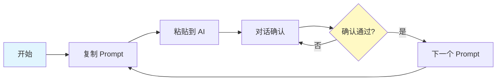

# Vibe Coding 后端开发实战教程

> 基于 Vibe Coding 方法论的后端开发完整流程模板

---

## 实战教程概览

```mermaid
flowchart LR
    A[开始] --> B[阶段A: 项目初始化]
    B --> C[阶段B: 文档生成]
    C --> D[阶段C: 代码生成]
    D --> E[结束]

    subgraph PhaseA [阶段A：项目初始化（静态文件）]
        A1[A_init]
    end

    subgraph PhaseB [阶段B：文档生成（动态文档）]
        B1[B1_PRD]
        B2[B2_FEATURES]
        B3[B3_API]
        B4[B4_SCHEMA]
        B5[B5_SERVICE]
    end

    subgraph PhaseC [阶段C：代码生成（TDD）]
        C1[C1_Models]
        C2[C2_Repository]
        C3[C3_Service]
        C4[C4_API]
        C5[C5_Report]
    end

    B --> A1
    A1 --> B1
    B1 --> B2
    B2 --> B3
    B3 --> B4
    B4 --> B5
    B5 --> C1
    C1 --> C2
    C2 --> C3
    C3 --> C4
    C4 --> C5
    C5 --> E

    style A fill:#e1f5fe
    style E fill:#e1f5fe
    style A1 fill:#fff3e0
    style B1 fill:#e8f5e9
    style B2 fill:#e8f5e9
    style B3 fill:#e8f5e9
    style B4 fill:#e8f5e9
    style B5 fill:#e8f5e9
    style C1 fill:#f3e5f5
    style C2 fill:#f3e5f5
    style C3 fill:#f3e5f5
    style C4 fill:#f3e5f5
    style C5 fill:#ffebee
```



---

## 使用说明



### 使用步骤

1. **按顺序使用 Prompt**：A → B1~B5 → C1~C5
2. **复制 Prompt** → 粘贴到 AI（Claude / Cursor / opencode）
3. **逐步确认**：每个文档/代码生成后确认再继续

---

## Prompt 文件列表

| 阶段 | 文件名 | 说明 | 输出 |
|------|--------|------|------|
| **A** | A_init.txt | 项目初始化 | 静态文件 |
| **B** | B1_PRD.txt | 需求文档 | PRD.md |
| | B2_FEATURES.txt | 功能梳理 | FEATURES.md |
| | B3_API.txt | 接口设计 | API_DESIGN.md |
| | B4_SCHEMA.txt | 数据模型 | SCHEMA.md |
| | B5_SERVICE.txt | 服务层设计 | SERVICE.md |
| **C** | C1_Models.txt | 数据模型代码 | models/, schemas/ |
| | C2_Repository.txt | Repository代码 | repositories/ + 测试 |
| | C3_Service.txt | Service代码 | services/ + 测试 |
| | C4_API.txt | API代码 | api/ + 测试 |
| | C5_Report.txt | 测试报告 | TEST_REPORT.md |

---

## 最终目录结构

```
project-name/
├── .boundary/              # Prompt A 生成
│   ├── scope.md
│   └── tech-stack.md
├── .ai-rules              # Prompt A 生成
├── .aiignore              # Prompt A 生成
├── docs/                  # Prompt B1~B5 生成
│   ├── PRD.md             # B1
│   ├── FEATURES.md        # B2
│   ├── API_DESIGN.md      # B3
│   ├── SCHEMA.md          # B4
│   ├── SERVICE.md         # B5
│   └── TEST_REPORT.md     # C5
├── src/                   # Prompt C1~C4 生成
│   ├── api/               # C4
│   ├── services/          # C3
│   ├── repositories/      # C2
│   ├── models/            # C1
│   ├── schemas/           # C1
│   ├── core/
│   └── utils/
└── tests/                 # Prompt C2~C4 生成
    ├── api/
    ├── services/
    └── repositories/
```

---

## 快速检查清单

### 阶段A：项目初始化
- [ ] 目录结构已创建
- [ ] .boundary/scope.md 已填写
- [ ] .boundary/tech-stack.md 已填写
- [ ] .ai-rules 已配置
- [ ] .aiignore 已创建

### 阶段B：文档生成
- [ ] B1：PRD.md（S-001...、BR-001...）
- [ ] B2：FEATURES.md（F-001...）
- [ ] B3：API_DESIGN.md（接口列表、JSON示例）
- [ ] B4：SCHEMA.md（实体定义、ER图）
- [ ] B5：SERVICE.md（服务定义、流程图）

### 阶段C：代码生成
- [ ] C1：数据模型层 + 迁移成功
- [ ] C2：Repository层 + 测试通过
- [ ] C3：Service层 + 测试通过
- [ ] C4：API层 + 测试通过
- [ ] C5：TEST_REPORT.md

---

*版本：v4.0*
*更新：2026-03-03*
