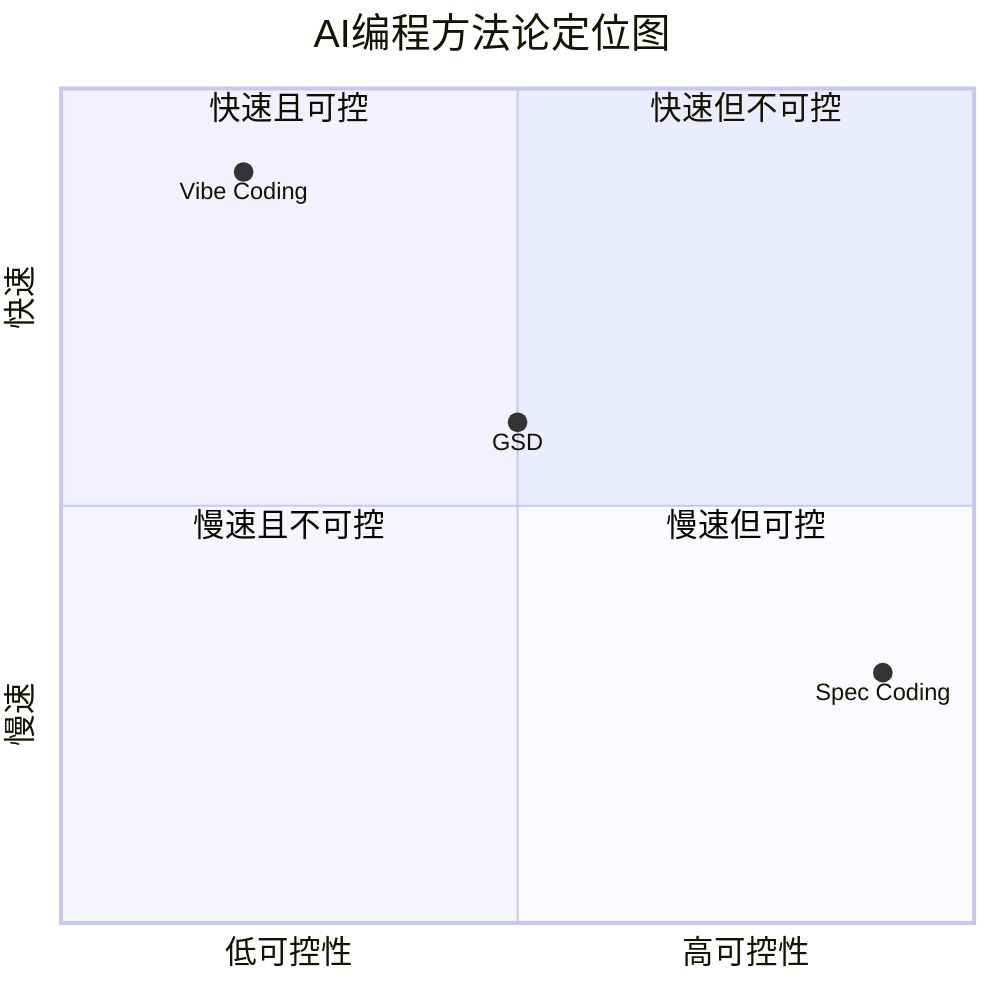
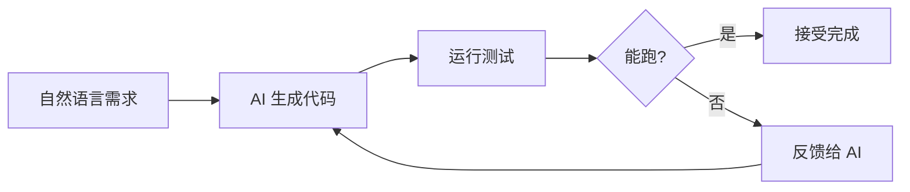
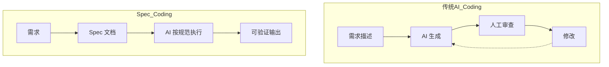
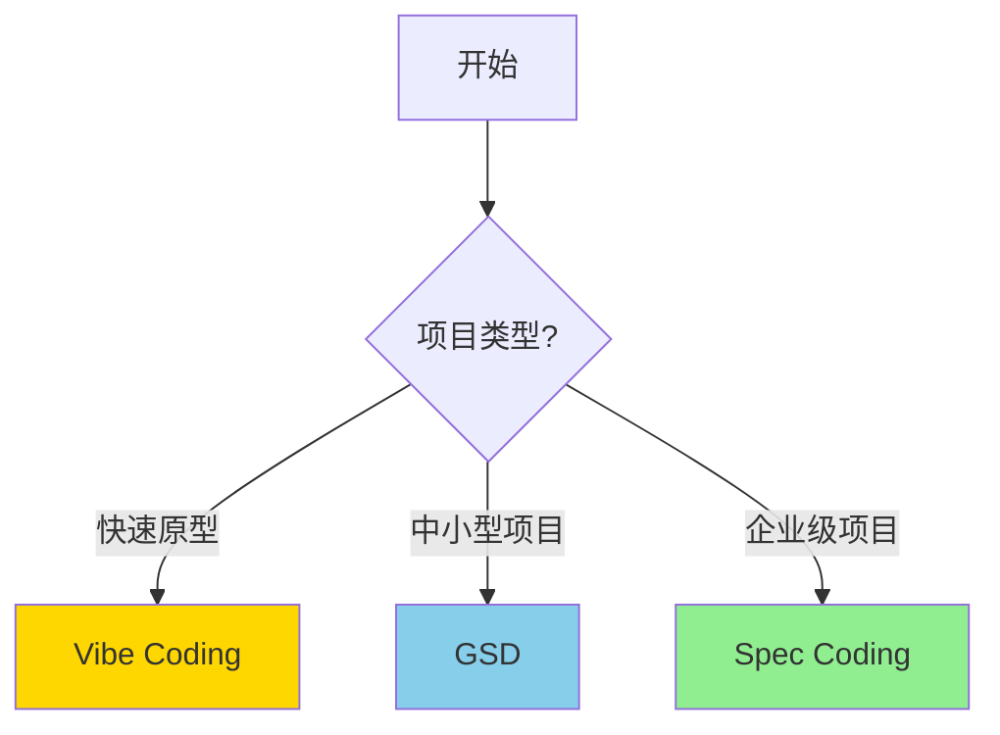
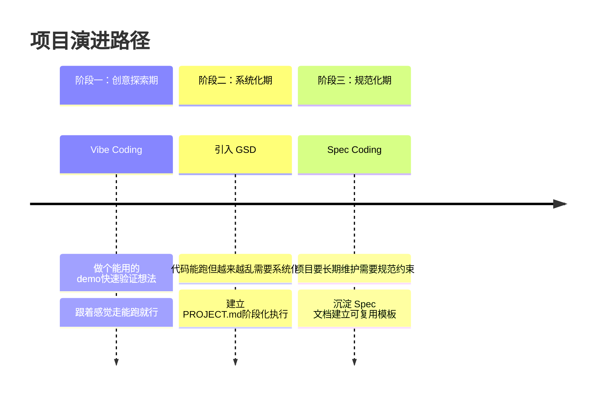

# VibeCoding、GSD 与 SpecCoding：三种 AI 编程方法论对比

> 从直觉驱动到系统化执行，再到规范约束——探索 AI 时代编程范式的演进

---

## 前言

随着 Claude Code、Cursor、OpenCode 等 AI 编程工具的普及，开发者社区逐渐分化出三种主流方法论：



这三种方法并非对立，而是代表不同场景下的最优解。

---

## 1. Vibe Coding：直觉驱动的快速原型

**定义**：由 OpenAI 联合创始人 Andrej Karpathy 提出，强调用自然语言与 AI 对话来生成代码，"能跑就行"。

**工作流**：



**特点**：
- 完全沉浸对话，不关注具体实现
- 快速迭代，高频反馈循环
- 接受不完美，以功能验证为先

**α/Ω 双提示词系统**：社区实践出一种递归进化方法——用 Ω 提示词不断优化 α 提示词，形成自我进化的提示词库。

**适用场景**：快速原型验证、个人工具开发、技术学习探索、一次性脚本

**局限性**：语义漂移、技术债高、协作困难、质量不稳定

---

## 2. Get-Shit-Done：系统化的中间地带

**定义**：GSD 是介于 Vibe 和 Spec 之间的方法论，核心思想是**通过阶段化执行 + 上下文重置，解决 AI 长对话中的"上下文腐烂"问题**。

**核心问题**：


**工作流**：


**多代理架构**：GSD 通过 11 个专门代理实现各阶段目标

```
规划阶段：planner → plan-checker → phase-researcher → roadmapper
执行阶段：executor → debugger
验证阶段：verifier → integration-checker
辅助工具：codebase-mapper → research-synthesizer
```

**XML 任务格式**：

```xml
<task type="auto">
  <name>Create login endpoint</name>
  <files>src/app/api/auth/login/route.ts</files>
  <action>
    Use jose for JWT (not jsonwebtoken - CommonJS issues).
    Validate credentials against users table.
    Return httpOnly cookie on success.
  </action>
  <verify>curl -X POST localhost:3000/api/auth/login returns 200 + Set-Cookie</verify>
  <done>Valid credentials return cookie, invalid return 401</done>
</task>
```

**OpenCode 集成**：

```bash
# 安装
npx gsd-opencode

# 使用
/gsd-new-project    # 初始化项目
/gsd-plan-phase 1   # 规划阶段
/gsd-execute-phase 1# 执行阶段
```

**三种使用模式**：

| 模式 | 适用场景 | 流程 |
|------|----------|------|
| 完整模式 | 复杂项目、从零开始 | Discuss → Plan → Execute → Verify |
| 快速模式 | 功能开发、Bug 修复 | 直接 Execute |
| 调试模式 | 问题排查 | 分析 → 假设 → 验证 → 修复 |

---

## 3. Spec Coding：规范驱动的工程化范式

**定义**：由亚马逊、OpenAI 等推动的工程化范式，强调"规范先行"，所有开发严格遵循书面规范。

**工作流对比**：



**三大原则**：

1. **规范先行**：开发始于详尽的规范文档
2. **结构化表达**：使用标准化格式定义需求
3. **可验证性**：每个实现点都有明确的参照标准

**Spec 文档格式**：

```text
# [功能名称] 规范

## 1. 需求概述
The system SHALL:
- MUST: 必须满足
- SHOULD: 应该满足
- MAY: 可以满足

## 2. 验收场景（Gherkin）
Scenario: 成功登录
- GIVEN 用户已注册且邮箱和密码正确
- WHEN 用户提交登录表单
- THEN 系统返回一个有效的会话令牌

## 3. 数据契约
LoginRequest:
  type: object
  properties:
    email: {type: string, format: email}
    password: {type: string, minLength: 8}
```

**三阶段文档体系**：

```
阶段1：项目宪法（技术栈约束、代码规范、质量标准）
阶段2：全局上下文（项目结构、工作流程、开发环境）
阶段3：具体规范（数据契约、行为契约、接口契约）
```

---

## 4. 三者对比与选择

### 全面对比表

| 对比维度 | Vibe Coding | Get-Shit-Done | Spec Coding |
|----------|-------------|---------------|-------------|
| 核心理念 | 跟着感觉走 | 系统化执行 | 规范为王 |
| 输入方式 | 自然语言 | 规范 + 阶段化 | 结构化规范 |
| 输出质量 | 不稳定 | 平衡 | 高且一致 |
| 开发速度 | 极快 | 平衡 | 较慢 |
| 可维护性 | 低 | 中等 | 高 |
| 学习曲线 | 低 | 中等 | 高 |
| 团队协作 | 困难 | 中等 | 优秀 |
| 适用规模 | 小型/原型 | 中小型 | 大型/企业级 |

### 决策树



---

## 5. 混合模式：实战最佳策略

很少有项目完全采用单一范式，更多是根据阶段灵活切换：



### 切换信号

**Vibe → GSD**：对话记录超过 50 条、修改 bug 导致新 bug、忘记之前设计思路

**GSD → Spec**：需要多人协作、维护周期 > 6 个月、代码质量问题频繁

### 实战建议

```
1. 前期（Vibe）：快速探索，一句话描述需求，能跑就行
2. 中期（GSD）：建立 PROJECT.md，用 ROADMAP.md 拆解任务
3. 后期（Spec）：将经验沉淀为 Spec 文档，建立可复用模板

关键原则：
- 无论哪种方式，都要 review 代码
- 大模型选择直接影响质量（推荐 Claude Sonnet 4.5+）
- 文档化的上下文是长期价值的来源
```

---

## 参考资料

### 开源工具

| 工具 | 链接 | 说明 |
|------|------|------|
| **get-shit-done** | https://github.com/glittercowboy/get-shit-done | GSD 官方仓库 |
| **gsd-opencode** | https://github.com/rokicool/gsd-opencode | OpenCode 移植版 |
| **spec-kit** | https://github.com/github/spec-kit | GitHub 官方 Spec 工具 |

### 推荐阅读

- [Vibe Coding 氛围编程系列](https://libin9ioak.blog.csdn.net/article/details/156399066)
- [AI 开发圈最近冒出一个狠角色：Get-Shit-Done](https://m.toutiao.com/a1857902197002248/)
- [Spec + RAG 打造 AI 程序员](https://blog.csdn.net/m0_59235945/article/details/158510280)
- [Vibe Coding VS Spec Coding](https://blog.csdn.net/zuozewei/article/details/156693866)

---

*文档版本：v1.2 (简化版)*
*更新日期：2026-03-04*
*本地 GSD 仓库：`C:\Users\15717\Desktop\Workspace\06_知识库\projects\vibecoding\03-方法论\get-shit-done\`*
