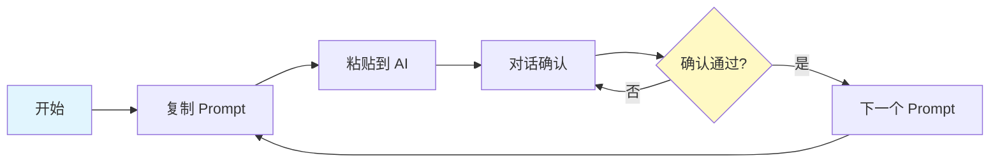

# 详细使用说明

> Backend Vibe Coding 完整使用教程

---

> **返回上级**：[← 项目总览](../README.md) | [快速开始](02-快速开始.md)

---

## Vibe Coding 后端开发实战教程

---

## 实战教程概览

```mermaid
flowchart LR
    A[开始] --> S{任务类型?}
    S -->|新功能/大改动| B[阶段A: 项目初始化]
    S -->|Bug修复/小改动| D[阶段D: 快速通道]
    B --> C[阶段B: 文档生成]
    C --> E[阶段C: 代码生成]
    E --> F[结束]

    subgraph PhaseA [阶段A：项目初始化（静态文件）]
        A1[A_init]
    end

    subgraph PhaseB [阶段B：文档生成（动态文档）]
        B1[B1_PRD]
        B2[B2_FEATURES]
        B3[B3_API]
        B4[B4_SCHEMA]
        B5[B5_SERVICE]
        B6[B6_TEST]
    end

    subgraph PhaseC [阶段C：代码生成（TDD）]
        C0[C0_Infrastructure]
        C1[C1_Models]
        C2[C2_Repository]
        C3[C3_Service]
        C4[C4_API]
        C5[C5_Frontend]
        C6[C6_Report]
    end

    subgraph PhaseD [阶段D：快速通道（小改动）]
        D1[D_quick_fix]
    end

    B --> A1
    S --> D1
    A1 --> B1
    B1 --> B2
    B2 --> B3
    B3 --> B4
    B4 --> B5
    B5 --> B6
    B6 --> C0
    C0 --> C1
    C1 --> C2
    C2 --> C3
    C3 --> C4
    C4 --> C5
    C5 --> C6
    C6 --> F
    D1 --> F

    style A fill:#e1f5fe
    style F fill:#e1f5fe
    style S fill:#fff9c4
    style D fill:#ffecb3
    style D1 fill:#ffecb3
    style A1 fill:#fff3e0
    style B1 fill:#e8f5e9
    style B2 fill:#e8f5e9
    style B3 fill:#e8f5e9
    style B4 fill:#e8f5e9
    style B5 fill:#e8f5e9
    style B6 fill:#e8f5e9
    style C0 fill:#ffd54f
    style C1 fill:#f3e5f5
    style C2 fill:#f3e5f5
    style C3 fill:#f3e5f5
    style C4 fill:#f3e5f5
    style C5 fill:#e0f7fa
    style C6 fill:#ffebee
```



---

## 快速通道 vs 完整流程

| 维度 | 完整流程 (A→B→C) | 快速通道 (D) |
|------|------------------|--------------|
| 适用场景 | 新功能、大改动 | Bug 修复、配置变更、小优化 |
| 步骤数 | 14 步（含 C0） | 5-8 步 |
| 文档生成 | 是 | 否 |
| 测试要求 | 完整 TDD | 视情况而定 |
| 上下文 | 加载全部文档 | 只加载必要文件 |
| 提交方式 | 阶段性提交 | 单次提交 |
| 典型耗时 | 30-60 分钟 | 5-15 分钟 |

---

## 使用说明



### 使用步骤

1. **按顺序使用 Prompt**：A → B1~B6 → C1~C6
2. **复制 Prompt** → 粘贴到 AI（Claude / Cursor / opencode）
3. **逐步确认**：每个文档/代码生成后确认再继续

---

## 顺序选择建议

### B阶段默认顺序

```
B1(PRD) → B2(FEATURES) → B3(API) → B4(SCHEMA) → B5(SERVICE) → B6(TEST)
```

这个顺序适合大多数Web API项目，遵循 **需求→功能→接口→数据→业务→测试** 的渐进设计逻辑。

### 灵活调整

| 项目类型 | 建议顺序 | 原因 |
|----------|----------|------|
| **Web API（默认）** | API → SCHEMA | 接口先行，以用户体验为中心，后期优化数据模型 |
| **数据密集型** | SCHEMA → API | 先保证数据一致性，再设计接口 |
| **BFF/前端驱动** | API更靠后 | 等待前端明确需求后再设计接口 |
| **复杂业务逻辑** | SERVICE更靠前 | 业务逻辑复杂需要提前梳理 |

### 自定义顺序

如果需要调整顺序：

1. 修改对应 Prompt 文件中的 **阶段衔接** 部分
2. 更新 README 和 flowsheet 中的流程图
3. 确保每个 Prompt 读取的输入文档顺序也相应调整

> 注意：SCHEMA(B4) 是 C1~C4 多个阶段的共同输入，如果调整顺序，需要确保后续阶段的输入文档路径正确。

---

## Prompt 文件列表

> 提示词文件位于 `../prompts/` 目录

| 阶段 | 文件名 | 说明 | 输出 |
|------|--------|------|------|
| **A** | A_init.txt | 项目初始化 | 静态文件 |
| **B** | B1_PRD.txt | 需求文档 | PRD.md |
| | B2_FEATURES.txt | 功能梳理 | FEATURES.md |
| | B3_API.txt | 接口设计 | API_DESIGN.md |
| | B4_SCHEMA.txt | 数据模型 | SCHEMA.md |
| | B5_SERVICE.txt | 服务层设计 | SERVICE.md |
| | B6_TEST.txt | 测试设计 | TEST_DESIGN.md |
| **C** | C0_Infrastructure.txt | 基础设施 | main.py, core/, requirements.txt, README, scripts/, Docker |
| | C1_Models.txt | 数据模型代码 | models/, schemas/ |
| | C2_Repository.txt | Repository代码 | repositories/ + 测试 |
| | C3_Service.txt | Service代码 | services/ + 测试 |
| | C4_API.txt | API代码 | api/ + 测试 |
| | C5_Frontend.txt | 前端验证 | Streamlit 前端 |
| | C6_Report.txt | 测试报告 | TEST_REPORT.md |
| **D** | D_quick_fix.txt | 快速通道 | 直接修改提交 |

---

## 最终目录结构

```
project-name/
├── .boundary/              # Prompt A 生成
│   ├── scope.md
│   └── tech-stack.md
├── .ai-rules              # Prompt A 生成
├── .aiignore              # Prompt A 生成
├── .gitignore             # Prompt A 生成 ← 新增
├── .env.example           # Prompt A/C0 生成
├── README.md              # Prompt A 生成框架 + C0 完善
├── main.py                # Prompt C0 生成
├── requirements.txt       # Prompt C0 生成
├── Dockerfile             # Prompt C0 生成（可选）← 新增
├── docker-compose.yml     # Prompt C0 生成（可选）← 新增
├── scripts/               # Prompt A/C0 生成 ← 新增
│   ├── dev.sh            # Linux/Mac 启动脚本
│   └── dev.bat           # Windows 启动脚本
├── docs/                  # Prompt B1~B6 生成
│   ├── PRD.md             # B1
│   ├── FEATURES.md        # B2
│   ├── API_DESIGN.md      # B3
│   ├── SCHEMA.md          # B4
│   ├── SERVICE.md         # B5
│   ├── TEST_DESIGN.md     # B6
│   └── TEST_REPORT.md     # C6
├── src/                   # Prompt C0~C4 生成
│   ├── api/               # C4
│   ├── services/          # C3
│   ├── repositories/      # C2
│   ├── models/            # C1
│   ├── schemas/           # C1
│   ├── core/              # C0
│   │   ├── config.py
│   │   ├── database.py
│   │   └── security.py
│   └── utils/
├── frontend/               # Prompt C5 生成
│   └── app.py             # Streamlit 前端
├── tests/                 # Prompt C1~C4 生成
│   ├── api/
│   ├── services/
│   ├── repositories/
│   └── models/
└── pytest.ini             # C2/C4 自动生成
```

---

## 快速检查清单

### 阶段A：项目初始化
- [ ] 目录结构已创建
- [ ] .boundary/scope.md 已填写
- [ ] .boundary/tech-stack.md 已填写
- [ ] .ai-rules 已配置
- [ ] .aiignore 已创建

### 阶段B：文档生成
- [ ] B1：PRD.md（S-001...、BR-001...）
- [ ] B2：FEATURES.md（F-001...）
- [ ] B3：API_DESIGN.md（接口列表、JSON示例）
- [ ] B4：SCHEMA.md（实体定义、ER图）
- [ ] B5：SERVICE.md（服务定义、流程图）
- [ ] B6：TEST_DESIGN.md（测试矩阵、分层策略）

### 阶段C：代码生成
- [ ] C0：基础设施（main.py、core/、requirements.txt）
- [ ] C1：数据模型层 + 迁移成功
- [ ] C2：Repository层 + 测试通过
- [ ] C3：Service层 + 测试通过
- [ ] C4：API层 + 测试通过
- [ ] C5：Streamlit 前端验证
- [ ] C6：TEST_REPORT.md

---

*版本：v5.2（完善 A_init 和 C0，添加 README、gitignore、Docker 等）*
*更新：2026-03-04*
