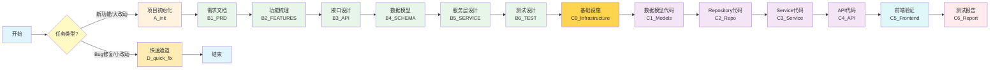

```mermaid
flowchart LR
    A[开始] --> S{任务类型?}
    S -->|新功能/大改动| B[项目初始化<br/>A_init]
    S -->|Bug修复/小改动| D[快速通道<br/>D_quick_fix]

    B --> C[需求文档<br/>B1_PRD]
    C --> E[功能梳理<br/>B2_FEATURES]
    E --> F[接口设计<br/>B3_API]
    F --> G[数据模型<br/>B4_SCHEMA]
    G --> H[服务层设计<br/>B5_SERVICE]
    H --> I[测试设计<br/>B6_TEST]
    I --> J[基础设施<br/>C0_Infrastructure]
    J --> K[数据模型代码<br/>C1_Models]
    K --> L[Repository代码<br/>C2_Repo]
    L --> M[Service代码<br/>C3_Service]
    M --> N[API代码<br/>C4_API]
    N --> O[前端验证<br/>C5_Frontend]
    O --> P[测试报告<br/>C6_Report]
    D --> Z[结束]

    style A fill:#e1f5fe
    style Z fill:#e1f5fe
    style P fill:#e1f5fe
    style S fill:#fff9c4
    style D fill:#ffecb3
    style B fill:#fff3e0
    style C fill:#e8f5e9
    style E fill:#e8f5e9
    style F fill:#e8f5e9
    style G fill:#e8f5e9
    style H fill:#e8f5e9
    style I fill:#e8f5e9
    style J fill:#ffd54f
    style K fill:#f3e5f5
    style L fill:#f3e5f5
    style M fill:#f3e5f5
    style N fill:#f3e5f5
    style O fill:#e0f7fa
    style P fill:#ffebee
```

---

> **快速通道说明**：对于 Bug 修复、配置变更、小优化等任务，使用 `D_quick_fix.txt` 直接处理，无需走完整流程。
>
> **C0 说明**：基础设施（main.py、数据库配置、依赖管理）在 B→C 交接时创建，为后续 C1-C4 提供基础。
