# Backend Vibe Coding v5 - 流程图

> **v5 Legacy 版本**
> 本版本为旧版流程，推荐使用 v6_refactored 版本

---

## 主流程图

```mermaid
flowchart LR
    A[开始] --> S{任务类型?}

    S -->|快速修复| D[D_quick_fix]
    S -->|新功能开发| P{项目规模?}

    P -->|小项目| A_init[A_init: 初始化]
    P -->|大项目| 暂未支持

    D --> Z[结束]

    A_init --> B1[B1: PRD]
    B1 --> B2[B2: 功能梳理]
    B2 --> B3[B3: API设计]
    B3 --> B4[B4: 数据模型]
    B4 --> B5[B5: 服务设计]
    B5 --> B6[B6: 测试设计]

    B6 --> R1[⚠️ 上下文重置]

    R1 --> C0[C0: 基础设施]
    C0 --> C1[C1: 数据模型]
    C1 --> C2[C2: Repository]
    C2 --> C3[C3: Service]
    C3 --> C4[C4: API]
    C4 --> C5[C5: 前端界面]
    C5 --> C6[C6: 测试报告]

    C6 --> Z

    style A fill:#e1f5fe
    style Z fill:#e1f5fe
    style S fill:#fff9c4
    style P fill:#fff9c4
    style D fill:#ffecb3
    style R1 fill:#ffccbc
    style A_init fill:#e8f5e9
    style B1 fill:#e8f5e9
    style B2 fill:#e8f5e9
    style B3 fill:#e8f5e9
    style B4 fill:#e8f5e9
    style B5 fill:#e8f5e9
    style B6 fill:#e8f5e9
    style C0 fill:#ffd54f
    style C1 fill:#f3e5f5
    style C2 fill:#f3e5f5
    style C3 fill:#f3e5f5
    style C4 fill:#f3e5f5
    style C5 fill:#e0f7fa
    style C6 fill:#ffebee
```

---

## 文档阶段（A_init + B1-B6）

| 步骤 | 文件 | 输出 |
|------|------|------|
| A_init | `A_init.txt` | 项目结构、配置文件 |
| B1 | `B1_PRD.txt` | `docs/PRD.md` |
| B2 | `B2_FEATURES.txt` | `docs/FEATURES.md` |
| B3 | `B3_API.txt` | `docs/API_DESIGN.md` |
| B4 | `B4_SCHEMA.txt` | `docs/SCHEMA.md` |
| B5 | `B5_SERVICE.txt` | `docs/SERVICE.md` |
| B6 | `B6_TEST.txt` | `docs/TEST_DESIGN.md` |

**⚠️ B6 完成后需要上下文重置**

---

## 实施阶段（C0-C6）

| 步骤 | 文件 | 输出 |
|------|------|------|
| C0 | `C0_Infrastructure.txt` | main.py、数据库配置、依赖 |
| C1 | `C1_Models.txt` | 数据模型代码 + 测试 |
| C2 | `C2_Repository.txt` | Repository 代码 + 测试 |
| C3 | `C3_Service.txt` | Service 代码 + 测试 |
| C4 | `C4_API.txt` | API 代码 + 测试 |
| C5 | `C5_Frontend.txt` | 前端界面 + E2E 测试 |
| C6 | `C6_Report.txt` | 最终测试报告 |

---

## 快速修复

| 场景 | 文件 |
|------|------|
| Bug 修复/快速修复 | `D_quick_fix.txt` |

---

## 与 v6 版本对比

| 特性 | v5 Legacy | v6 Refactored |
|------|-----------|---------------|
| 流程步骤 | 13 步 | 10 步（简化） |
| 文档阶段 | 6 步 | 3 步（合并测试设计） |
| 快速通道 | 1 种 | 4 种细分 |
| 大项目支持 | 暂未支持 | L_large 完整流程 |
| ORM | Tortoise ORM | SQLAlchemy |

---

*迁移建议：新项目请使用 v6_refactored 版本*
