# Backend Vibe Coding v6 - 流程图

> **v6.0 架构重构版本**
> 本流程图展示了新的分层架构：快速修复(D)、小项目(S)、大项目(L)

---

## 主流程图

```mermaid
flowchart LR
    A[开始] --> S{任务类型?}

    S -->|Bug修复/配置/优化/文档| D[D快速通道<br/>D1~D4]
    S -->|新功能开发| P{项目规模?}

    P -->|小项目| S0[S0: 初始化]
    P -->|大项目| L0[L0: 初始化]

    D --> Z[结束]

    S0 --> S1[S1: 功能梳理+测试]
    S1 --> S2[S2: 数据模型+测试]
    S2 --> S3[S3: API设计+测试]

    S3 --> R1[⚠️ 上下文重置]

    R1 --> S4[S4: 基础设施]
    S4 --> S5[S5: 数据模型]
    S5 --> S6[S6: Repository]
    S6 --> S7[S7: Service]
    S7 --> S8[S8: API]
    S8 --> S9[S9: 验证测试]
    S9 --> S10[S10: 测试报告]

    S10 --> Z

    L0 --> L1[L1: 泳道图]
    L1 --> L2[L2: PRD]
    L2 --> L3[L3: 功能梳理]
    L3 --> L4[L4: 业务文档]
    L4 --> L5[L5: 数据模型]
    L5 --> L6[L6: API设计]
    L6 --> L7[L7: 模块拆分⚡]

    L7 --> M1[📦 模块A → S_simple]
    L7 --> M2[📦 模块B → S_simple]
    L7 --> M3[📦 模块C → S_simple]

    M1 --> L19
    M2 --> L19
    M3 --> L19

    L19 --> L19[L19: 模块集成]
    L19 --> L20[L20: API Gateway]
    L20 --> L21[L21: 整体验证]

    L21 --> Z

    style A fill:#e1f5fe
    style Z fill:#e1f5fe
    style S fill:#fff9c4
    style P fill:#fff9c4
    style D fill:#ffecb3
    style R1 fill:#ffccbc
    style L7 fill:#ffe082
    style S0 fill:#e8f5e9
    style S1 fill:#e8f5e9
    style S2 fill:#e8f5e9
    style S3 fill:#e8f5e9
    style S4 fill:#ffd54f
    style S5 fill:#f3e5f5
    style S6 fill:#f3e5f5
    style S7 fill:#f3e5f5
    style S8 fill:#f3e5f5
    style S9 fill:#e0f7fa
    style S10 fill:#ffebee
    style L0 fill:#e8f5e9
    style L1 fill:#e8f5e9
    style L2 fill:#e8f5e9
    style L3 fill:#e8f5e9
    style L4 fill:#e8f5e9
    style L5 fill:#e8f5e9
    style L6 fill:#e8f5e9
    style L19 fill:#ffd54f
    style L20 fill:#ffd54f
    style L21 fill:#ffebee
```

---

## D 快速通道（4种场景）

| 场景 | 提示词文件 | 适用情况 |
|------|-----------|---------|
| Bug 修复 | `D_quick/D1_bugfix.txt` | 修复已知问题或错误 |
| 配置变更 | `D_quick/D2_config.txt` | 修改配置文件或环境变量 |
| 小优化 | `D_quick/D3_optimize.txt` | 性能优化或代码改进 |
| 文档更新 | `D_quick/D4_doc.txt` | 更新文档或注释 |

---

## S_simple 小项目流程（10步）

### 文档阶段（3步，含测试设计）

| 步骤 | 提示词文件 | 输出 |
|------|-----------|------|
| S0 | `S_simple/初始化/S0_init.txt` | 项目结构、配置文件 |
| S1 | `S_simple/文档阶段/S1_features.txt` | `docs/FEATURES.md` + 测试策略 |
| S2 | `S_simple/文档阶段/S2_schema.txt` | `docs/SCHEMA.md` + 数据层测试 |
| S3 | `S_simple/文档阶段/S3_api.txt` | `docs/API_DESIGN.md` + API测试 |

**⚠️ S3 完成后需要上下文重置**

### 实施阶段（7步，每步有测试报告）

| 步骤 | 提示词文件 | 输出 |
|------|-----------|------|
| S4 | `S_simple/实施阶段/S4_infra.txt` | main.py、数据库配置、依赖 |
| S5 | `S_simple/实施阶段/S5_models.txt` | 数据模型代码 + 测试 + 报告 |
| S6 | `S_simple/实施阶段/S6_repo.txt` | Repository 代码 + 测试 + 报告 |
| S7 | `S_simple/实施阶段/S7_service.txt` | Service 代码 + 测试 + 报告 |
| S8 | `S_simple/实施阶段/S8_api.txt` | API 代码 + 测试 + 报告 |
| S9 | `S_simple/实施阶段/S9_verify.txt` | 前端界面 + E2E 测试 |
| S10 | `S_simple/实施阶段/S10_report.txt` | 最终测试报告 |

---

## L_large 大项目流程（三步走）

### 第一步：整体规划（L0-L7）

| 步骤 | 提示词文件 | 输出 |
|------|-----------|------|
| L0 | `L_large/初始化/L0_init.txt` | 项目结构（支持多模块） |
| L1 | `L_large/文档阶段/L1_lane.txt` | `docs/ARCHITECTURE.md`（泳道图、时序图） |
| L2 | `L_large/文档阶段/L2_prd.txt` | `docs/PRD.md`（整体需求） |
| L3 | `L_large/文档阶段/L3_features.txt` | `docs/FEATURES.md`（整体功能） |
| L4 | `L_large/文档阶段/L4_business.txt` | `docs/BUSINESS.md`（业务文档） |
| L5 | `L_large/文档阶段/L5_schema.txt` | `docs/SCHEMA.md`（整体数据模型） |
| L6 | `L_large/文档阶段/L6_api.txt` | `docs/API_DESIGN.md`（整体API） |
| **L7** | `L_large/文档阶段/L7_split.txt` | `docs/MODULE_SPLIT.md`（⚡模块拆分） |

**⚠️ L7 是关键节点：定义模块边界，为后续模块开发做准备**

### 第二步：单一模块（调用 S_simple）

对 L7 拆分的每个模块：
1. 读取 `docs/MODULE_SPLIT.md` 了解模块职责
2. 调用 `S_simple` 流程生成模块代码
3. 将模块代码放置到 `src/modules/{模块名}/`

### 第三步：组合测试（L19-L21）

| 步骤 | 提示词文件 | 输出 |
|------|-----------|------|
| L19 | `L_large/实施阶段/L19_integrate.txt` | 模块集成 + 集成测试 |
| L20 | `L_large/实施阶段/L20_gateway.txt` | API Gateway 配置 |
| L21 | `L_large/实施阶段/L21_verify.txt` | 端到端验证 + 最终报告 |

---

## 上下文重置说明

### 需要重置的节点

| 节点 | 原因 |
|------|------|
| S3 → S4 | 文档阶段→实施阶段，对话已较长 |
| L7 → 模块A | 整体规划→模块实施，切换到新模块 |
| 模块A → 模块B | 避免跨模块上下文污染 |

### 不需要重置的节点

| 节点 | 原因 |
|------|------|
| S4 → S5 | S4 创建的基础设施是 S5 的直接依赖 |
| S5 → S6 → S7 → S8 → S9 | 同一实施阶段，保持上下文 |

---

## 使用建议

1. **从 A_Decision.txt 开始**
   - 让 AI 帮你判断任务类型和项目规模
   - 自动选择合适的流程

2. **小项目使用 S_simple**
   - 单一数据对象（如 User、Article）
   - 开发周期 1-3 天
   - 2-5 个 API 端点

3. **大项目使用 L_large**
   - 多个数据对象需要关联
   - 需要多个模块协作
   - 开发周期超过 3 天

4. **快速修复使用 D_quick**
   - Bug 修复、配置变更、小优化、文档更新
   - 不走完整流程，直接搞定

---

*更新日期：2026-03-09（v6.0 架构重构版本）*
